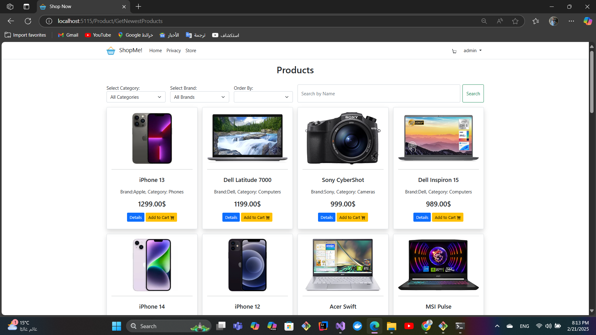
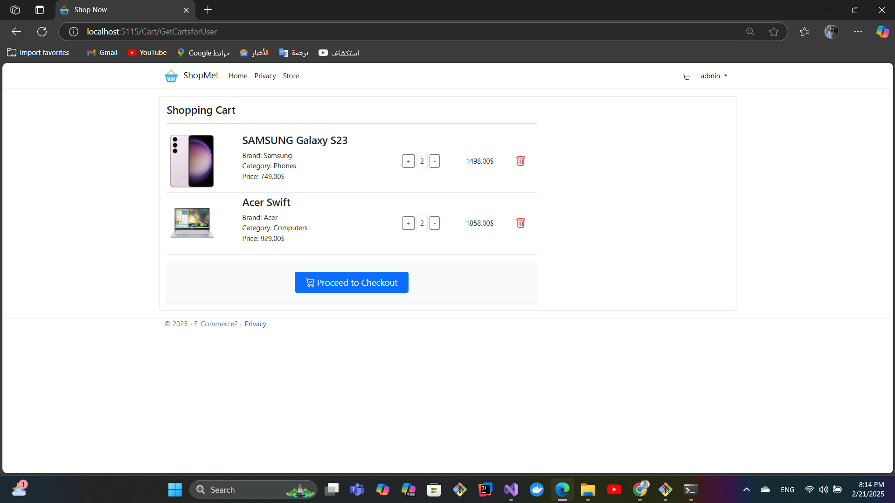
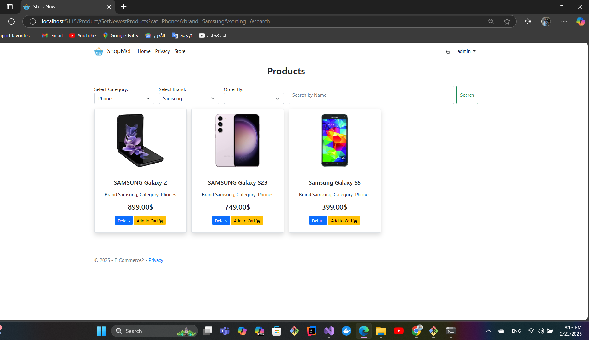
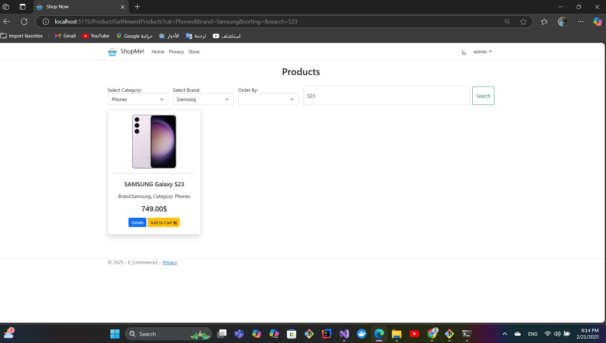

# ShopMe - E-Commerce MVC Application

ShopMe is an E-Commerce web application built using the ASP.NET MVC framework. It follows the Model-View-Controller (MVC) architectural pattern and utilizes the **Unit of Work** and **Repository** design patterns for efficient data access and management. The application provides features like user authentication, product management, cart functionality, order processing, and payment integration.

---

## Features

- **User Authentication**: Register, login, and manage user profiles.
- **Product Management**: Admins can add, update, and delete products.
- **Shopping Cart**: Users can add/remove products to/from their cart.
- **Order Processing**: Users can place orders and view order history.
- **Payment Integration**: Secure payment processing for orders.
- **Admin Dashboard**: Manage products, orders, and users.

---

## Technologies Used

- **Frontend**: HTML, CSS, Bootstrap, Razor Views
- **Backend**: ASP.NET MVC, C#
- **Database**: SQL Server (or your chosen database)
- **Design Patterns**: Unit of Work, Repository
- **Authentication**: ASP.NET Identity
- **Payment Gateway**: Stripe

---

## Project Structure

### Controllers
- **AuthController**: Handles user authentication (register, login, logout).
- **CartController**: Manages shopping cart operations (add, remove, view cart).
- **AdminController**: Handles admin-specific actions (product management, user management).
- **PaymentController**: Manages payment processing and integration.
- **ProductController**: Handles product-related actions (list, details, search).
- **OrderController**: Manages order placement and order history.

### Models
- **Cart**: Represents the shopping cart.
- **Product**: Represents product details.
- **Order**: Represents order details.
- **OrderItem**: Represents order details.
- **User**: Represents user details.
- **Payment**: Represents payment details.

### Repositories
- **ProductRepository**: Handles product data access.
- **OrderRepository**: Handles order data access.
- **CartRepository**: Handles cart data access.
- **UserRepository**: Handles user data access.

### Unit of Work
- **UnitOfWork**: Manages repositories and ensures consistency in database operations.

### Views
- Razor views for each controller action (e.g., `Index`, `Details`, `Checkout`).

---

## Getting Started

### Prerequisites
- .NET SDK (version 6.0 or higher)
- SQL Server (or your preferred database)
- Visual Studio or Visual Studio Code

### Installation
1. Clone the repository:
   ```bash
   git clone https://github.com/MohamedAbdelaziz177/ShopMe.git

 ##Some Screenshots

### Home Page


### Cart Page


### Applying Filter


### Applying Search

